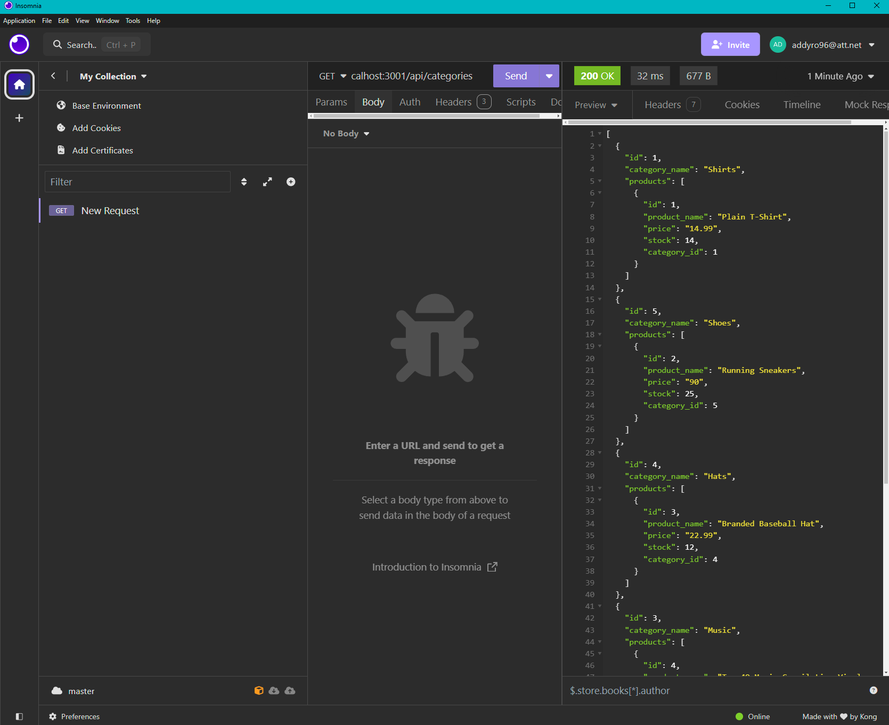

# CommerceChampion

CommerceChampion is the backend for your e-commerce website! Developed with Express.js, this API leverages Sequelize for seamless interaction with a PostgreSQL database. CommerceChampion enables effortless management of products, categories, and tags.

- Add your PostgreSQL database name, username, and password to the environment variable file to connect to your database. Sequelize will manage the connection for you.

- Set up a development database by executing the schema and seed commands. These commands will create the database structure and populate it with test data.

- Launch your server with a single command. The application will automatically synchronize Sequelize models with the PostgreSQL database.

- Use Insomnia to access API GET routes for categories, products, or tags to view the data presented in a well-organized JSON format.

- Utilize Insomnia to test API POST, PUT, and DELETE routes, enabling efficient creation, updating, and deletion of data in your database.

## Installation

To install CommerceChampion:

- Clone the repository: https://github.com/AcoderRose/CommerceChampion

- Go to the project directory

- Launch the terminal and install the dependencies by executing the following command: `npm install`

- Set up the PostgreSQL database with the following commands:

  - Input `psql -U postgres` to open the PostgreSQL command line interface. If prompted, input your password.
  - To set up the database, type `\i schema.sql` and press Enter.
    Now your database is set up correctly!

- Remove '.EXAMPLE' from the .env.EXAMPLE file renaming it to .env

- Configure that .env file with your database credentials

- Seed data to your database so that you can test your routes, in the terminal by executing the following command: `npm run seed`

## Usage

- Start the application, in the terminal by executing the following command: `npm start`

[Link to Walkthrough Video](https://drive.google.com/file/d/1UlspjR8yGbdl770-qjP46BhdAufHVmwG/view?usp=sharing)

## Credits

[Kaila Ronquillo](https://github.com/girlnotfound)

[Ryan Petersen](https://github.com/RyanPetersen-89)
